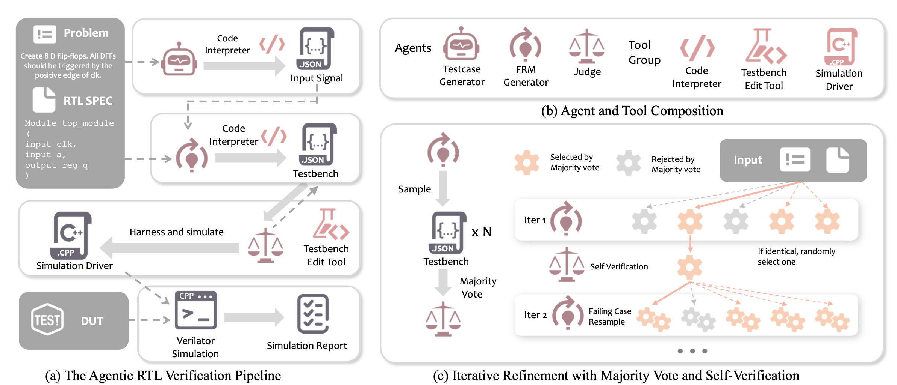
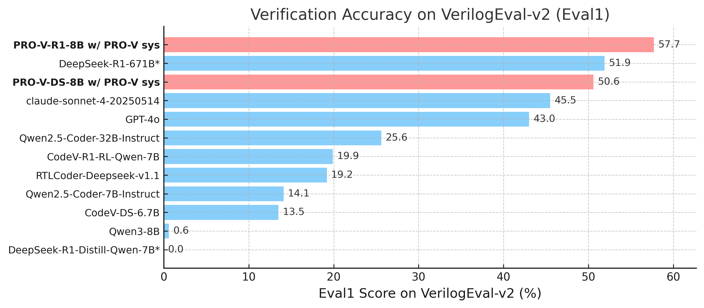

# PRO-V: An Efficient Program Generation Multi-Agent System for Automatic RTL Verification

<div align="center">

[](https://arxiv.org/pdf/2506.12200)
[](https://huggingface.co/YujieZhao/PRO-V-R1-8B)
[](https://github.com/pettingllms-ai/PettingLLMs/tree/main/pettingllms/multi_agent_env/pychecker_rl)
[](LICENSE)

</div>

## 📋 Table of Contents

- [Background](#background)
- [Experimental Results](#experimental-results)
- [Quick Start](#quick-start)
- [Environment Setup](#environment-setup)
- [Usage](#usage)
- [Resources](#resources)

## Background

PRO-V is a comprehensive framework for automated Register Transfer Level (RTL) code generation using reinforcement learning and multi-agent systems. The framework addresses the challenge of generating high-quality, functionally correct Verilog code through an iterative verification and refinement process.



Our approach combines:
- **Multi-Agent System**: Coordinated agents for code generation, testbench creation, simulation, and debugging
- **Reinforcement Learning**: Policy optimization using verification outcomes as rewards
- **Iterative Refinement**: Automated debugging loop to fix compilation and simulation errors

## Experimental Results

### Main Results on VerilogEval-v2 
*Note: Bold indicates best performance, italic indicates second best.*

### Ablation Study on VerilogEval-v2

Progressive improvements by adding PRO-V Flow, SFT, and RL to the base model:

| Model / Method | Eval0 | Eval1 | Eval2-80 | Eval2-90 | Eval2-100 |
|----------------|-------|-------|----------|----------|-----------|
| Qwen3-8B | 0.6 | 0.6 | 0.6 | 0.6 | 0.0 |
| Qwen3-8B w/ CorrectBench | 47.4 | 25.6 | 23.7 | 23.1 | 21.8 |
| Qwen3-8B w/ PRO-V sys | 64.7 | 39.1 | 35.9 | 32.1 | 28.2 |
| PRO-V-DS-8B w/ PRO-V sys | 93.6 | 50.6 | 35.9 | 34.0 | 27.6 |
| **PRO-V-R1-8B w/ PRO-V sys** | **94.9** | **57.7** | **44.2** | **37.8** | **34.0** |

## 🚀 Quick Start

### Step 1: Environment Setup

```bash
# Clone the repository
git clone https://github.com/YourRepo/PRO-V.git
cd PRO-V

# Create conda environment
conda create -n pro-v python=3.11
conda activate pro-v

# Install the package
pip install -e .
```

### Step 2: Download Model

Download the PRO-V-R1-8B model from HuggingFace:

```bash
# Using huggingface-cli
huggingface-cli download YujieZhao/PRO-V-R1-8B --local-dir ./models/PRO-V-R1-8B

# Or using git
git lfs install
git clone https://huggingface.co/YujieZhao/PRO-V-R1-8B ./models/PRO-V-R1-8B
```

### Step 3: Configure Evaluation Scripts

Edit the model path in the evaluation scripts:

**For `scripts/run_evaluation_think_simple.sh`:**
```bash
MODEL_PATH="./models/PRO-V-R1-8B"
SERVED_MODEL_NAME="PRO-V-R1-8B"
```

**For `scripts/run_evaluation_think.sh`:**
```bash
MODEL_PATH="./models/PRO-V-R1-8B"
SERVED_MODEL_NAME="PRO-V-R1-8B"
EXPERIMENT_NAME="pro_v_r1_8b_eval"
```

### Step 4: Run Evaluation

```bash
cd scripts

# Simple evaluation (single process)
bash run_evaluation_think_simple.sh

# Or advanced evaluation (Ray-based parallel processing)
bash run_evaluation_think.sh
```

## 📦 Environment Setup

### 1.> Install the Repository

```bash
git clone https://github.com/YourRepo/PRO-V.git
cd PRO-V

# Get submodules (benchmark datasets)
git submodule update --init --recursive

# Create conda environment
conda create -n pro-v python=3.11
conda activate pro-v

# Install the package
pip install -e .
```


### 2.> Install Icarus Verilog (v12)

**Ubuntu (Local Compilation)**
```bash
apt install -y autoconf gperf make gcc g++ bison flex

git clone https://github.com/steveicarus/iverilog.git && cd iverilog
git checkout v12-branch
sh ./autoconf.sh && ./configure && make -j4
sudo make install
```

**MacOS**
```bash
brew install icarus-verilog
```

**Version Confirmation**

Verify the installation:
```bash
iverilog -v
```

Expected output (first line):
```
Icarus Verilog version 12.0 (stable) (v12_0)
```

### 3.> Install Verilator

```bash
# By apt (Ubuntu/Debian)
sudo apt install verilator

# By Homebrew (MacOS)
brew install verilator

# By Compilation
git clone https://github.com/verilator/verilator
cd verilator
autoconf
export VERILATOR_ROOT=`pwd`
./configure
make -j4
```


## 📖 Usage

### Running Evaluations

PRO-V provides two evaluation scripts:

#### 1. Simple Evaluation (Single Process)

Edit `scripts/run_evaluation_think_simple.sh`:

```bash
# Configure GPU and model
GPU_IDS="0,1"  # GPUs to use
MODEL_PATH="./models/PRO-V-R1-8B"
SERVED_MODEL_NAME="PRO-V-R1-8B"
EXPERIMENT_NAME="pro_v_eval"

# Parallelism settings
TP_SIZE=2  # Tensor parallel size
DP_SIZE=1  # Data parallel size
```

Run the evaluation:

```bash
cd scripts
bash run_evaluation_think_simple.sh
```

#### 2. Advanced Evaluation (Ray-based Parallel)

Edit `scripts/run_evaluation_think.sh`:

```bash
# Configure GPU and model
GPU_IDS="0,1,2,3"  # GPUs to use
MODEL_PATH="./models/PRO-V-R1-8B"
SERVED_MODEL_NAME="PRO-V-R1-8B"
EXPERIMENT_NAME="pro_v_eval_parallel"

# Parallelism settings
TP_SIZE=4  # Tensor parallel size
DP_SIZE=1  # Number of replicas
MAX_CONCURRENCY=50  # Concurrent tasks
```

Run the evaluation:

```bash
cd scripts
bash run_evaluation_think.sh
```

### Customizing Evaluation Parameters

Both scripts support various parameters:

```bash
# Sampling parameters
TEMPERATURE=0          # Temperature for generation
TOP_P=0.95            # Top-p sampling
MAX_TOKEN=20000       # Maximum tokens per generation

# Task filtering
TASK_NUMBERS="1,2,3"  # Specific tasks to run
FILTER_INSTANCE="^(Prob011_norgate)$"  # RegEx filter

# Benchmark selection
FOLDER_PATH="./verilog-eval/HDLBits/test_benchmark_new.json"
```

### Output Structure

Results are saved to `outputs/<EXPERIMENT_NAME>/`:

```
outputs/
└── pro_v_eval/
    ├── all_results.json      # Aggregated results
    ├── overall_stats.json    # Statistics
    ├── task_1/              # Individual task outputs
    ├── task_2/
    └── ...
```
